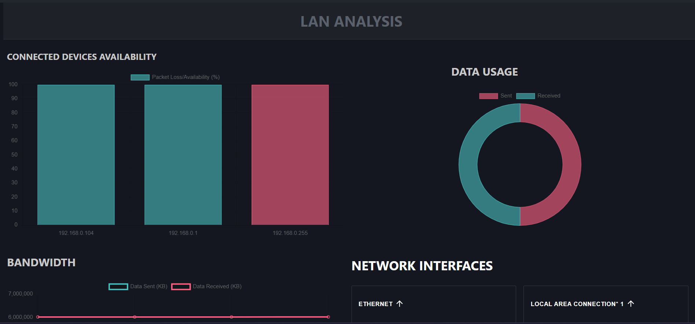

# LAN Analysis



## Introduction

A python based local web app with React.js UI that analyzes the LAN network (designed for star topology) and offers various information, including:

- A list of all devices connected to the hub.
- Bandwidth usage of the hub.
- A list of all network interfaces on the hub.
- Wi-Fi information of the hub.
- vEthernet information of the hub.
- DNS Server information.

## Getting Started

### Installation

To get started with this project, follow these steps:

1. Fork the repository and clone it to your local machine.

```bash
   git clone <forked-repo-url>
```

1. Change the directory to the cloned repository.

```bash
   cd lan-analysis-backend
```

### Run Backend

To run the backend, perform the following steps:

- Change to the backend directory.

```bash
   cd backend
```

- Create a virtual environment.

```bash
   python -m venv venv
```

- Activate the virtual environment.

```bash
   .\venv\Scripts\activate
```

- Install the dependencies.

```bash
   pip install -r requirements.txt
```

- Run the Flask server.

```bash
   python app.py
```

Alternatively, you can run the command line script:

```bash
   python cli.py
```

### Run Frontend

To run the frontend, follow these steps:

- Open another terminal and change the directory to the frontend.

```bash
   cd frontend
```

- Navigate to the `frontend\main` directory.

```bash
   cd main
```

- Install the dependencies.

```bash
   npm install
```

- Run the React server.

```bash
   npm run dev
```
